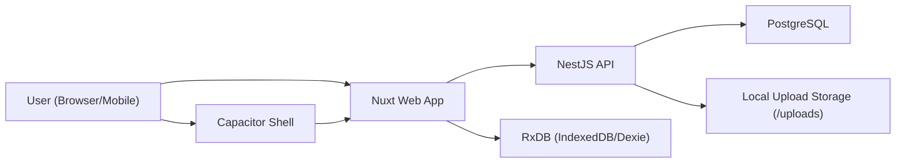
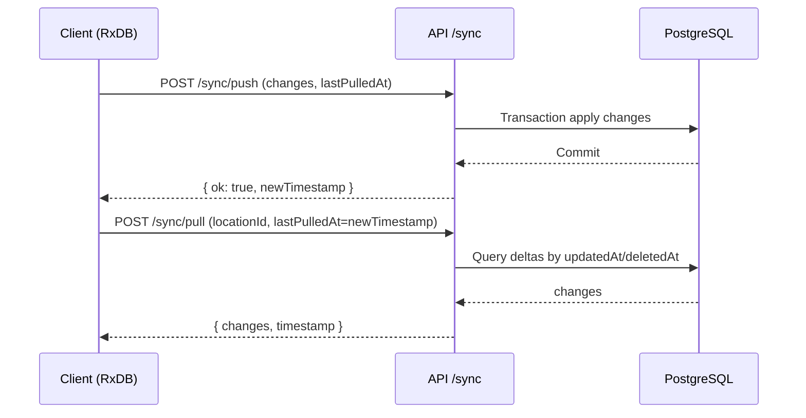

# JTrack Architecture

## 1. Overview
JTrack is a monorepo CRM platform with a web client, mobile shell, and a NestJS API backed by PostgreSQL.  
The architecture favors:
- clear domain modules,
- strict tenant scoping by location,
- offline-first client behavior with explicit server reconciliation.

## 2. Repository Structure
```text
apps/
  api/        # NestJS + Prisma + RBAC + sync
  web/        # Nuxt 4 + Pinia + RxDB
  mobile/     # Capacitor wrapper
packages/
  shared/     # Zod schemas + DTOs + RBAC constants + sync contracts
  eslint-config/
  tsconfig/
docker/
  docker-compose.yml
```

## 3. Container/Runtime View


## 4. API Layer (NestJS)
### 4.1 Module Boundaries
- `auth`: login/refresh/logout/me, invite onboarding completion, JWT issuance, refresh token rotation.
- `rbac`: role/privilege resolution and access checks.
- `locations`: tenant container lifecycle.
- `users`: membership and operator management.
- `tickets`, `comments`, `attachments`, `payments`: core domain CRUD.
- `sync`: delta pull/push and conflict handling.
- `health`: readiness/liveness probe endpoint with DB connectivity check.
- `prisma`: DB access abstraction and lifecycle.

### 4.2 Cross-Cutting Guards
- `JwtAuthGuard`: validates bearer access token.
- `LocationGuard`: enforces `x-location-id` + active membership; for admin bypass, writes synthetic `locationRole=Owner` into request context.
- `PrivilegesGuard`: validates endpoint privilege set against role.
- `ZodValidationPipe`: validates request payloads at controller boundary using shared schema contracts and normalizes JSON-stringified bodies before schema parse.
- `serializeDates` helper (`apps/api/src/common/date-serializer.ts`): centralizes `Date -> ISO string` conversion for API response mapping in service layer.

## 5. Data Architecture
- PostgreSQL as source of truth.
- Prisma schema defines:
  - enums for role/status/provider kinds,
  - referential integrity via foreign keys,
  - indexes tuned for location-scoped queries and sync windows.
- Soft-delete only where sync tombstones are required.
- User deletion is hard-delete with transactional session invalidation (`refreshTokenHash` reset) and reassignment of historical `createdBy`/`assignedTo`/`author`/`uploadedBy` references to a reserved non-admin system user to satisfy FK constraints.
- Location deletion is guarded by application checks: if any location-scoped business records exist, API returns conflict instead of attempting FK-breaking hard delete.

## 6. Client Architecture
### 6.1 Web App
- Nuxt 4 (Vue 3) for UI and routing.
- RxDB/Dexie as local reactive storage.
- RxDB v16 document writes use `incrementalPatch`/`incrementalModify` (not `atomicPatch`) for compatibility.
- Logout flow destroys local RxDB storage and immediately recreates a clean instance for same-tab re-login safety.
- Outbox pattern:
  - local mutation first,
  - enqueue operation,
  - background push + pull convergence.
- On active location switch, client prunes location-scoped RxDB records for non-active locations to prevent cross-tenant accumulation/leakage.
- Offline attachments are staged in RxDB (`pendingAttachmentUploads`) and converted to regular attachment outbox records after deferred upload when connectivity returns; base64 file payload is stored only in staging collection (attachment placeholder keeps pending metadata without duplicating file bytes).

### 6.2 Mobile App
- Capacitor wraps web build output.
- Reuses same frontend and sync logic.

## 7. Sync and Data Flow


- `GET /tickets` uses offset pagination (`limit`, `offset`) and returns `{ items, page }`.
- `POST /sync/pull` uses cursor pagination with per-entity offsets and a fixed `snapshotAt` timestamp to keep multipage pulls consistent.
- `POST /sync/push` preloads existing records by batched `findMany(where: { id: { in: [...] } })` per entity to avoid N+1 lookups inside mutation loops.

## 8. Security Architecture
- Access:
  - short-lived JWT access token in Authorization header.
  - refresh token in HttpOnly cookie (`/auth` path).
  - invite onboarding uses signed short-lived invite token (`/auth/invite/complete`) and atomically claims membership (`invited` -> `active`) in the same transaction as initial password set.
  - refresh cookie `secure` flag is controlled by `COOKIE_SECURE` (fallback: `NODE_ENV === production`).
  - auth brute-force mitigation is enforced via throttling on `/auth/login` and `/auth/refresh`.
- Authorization:
  - location scoping for tenant separation.
  - privilege-based endpoint checks.
  - admin override for internal operators.

## 9. Deployment Notes
- Local dev:
  - Dedicated Docker images/containers:
    - `docker/Dockerfile.web` -> image `jtrack-web`, container `jtrack-web`
    - `docker/Dockerfile.api` -> image `jtrack-api`, container `jtrack-api`
    - `postgres:16` -> `jtrack-postgres`
  - API/Web Dockerfiles use multi-stage builds (`deps` -> `builder` -> `runner`) to reduce runtime image size.
  - Docker build context filtering uses repository `.dockerignore`; docker-local mirror rules are stored in `docker/.dockerignore`.
  - Startup via `docker/docker-compose.yml` (`docker-compose up -d --build`).
  - API container startup runs `prisma migrate deploy --schema apps/api/prisma/schema.prisma` before `node apps/api/dist/src/main.js`.
  - DB service has network alias `jtrack`; API uses `postgresql://...@jtrack:5432/...`.
  - Legacy Prisma migration `20260223082027_init` is a no-op placeholder to keep migration chain valid in clean environments.
  - API TypeScript output is fixed to `apps/api/dist` (`apps/api/tsconfig.json` with explicit `outDir`).
  - API runtime entrypoint is `node dist/src/main.js` (`apps/api/package.json` start script).
- Cloud deploy:
  - Backend (Render): `/Users/vlad/Projects/JTrack/render.yaml`
    - Deploys `jtrack-api` from `docker/Dockerfile.api`.
    - Uses Render Postgres `jtrack-db`.
    - Uses `dockerCommand` to export `API_PORT` from Render `PORT`, apply Prisma migrations, and start `node apps/api/dist/src/main.js`.
  - Frontend (Vercel): `/Users/vlad/Projects/JTrack/vercel.json`
    - Builds static Nuxt output via `pnpm --filter @jtrack/web build:mobile`.
    - Publishes `apps/web/.output/public`.
    - SPA fallback rewrite to `/index.html`.
- Production target:
  - stateless API instances behind load balancer,
  - managed PostgreSQL,
  - object storage provider replacing local uploads,
  - optional CDN for static/web assets.

## 10. Architectural Risks and Mitigations
- Risk: sync conflicts under intermittent connectivity.
  - Mitigation: deterministic server-wins policy + pull-after-push.
- Risk: tenant leakage by missing location context.
  - Mitigation: mandatory `x-location-id` guard and role checks.
- Risk: stale refresh tokens.
  - Mitigation: refresh token hashing + rotation on refresh/login.

## 11. Testing Architecture
- Test runner:
  - `Vitest` is configured per package (`apps/api`, `apps/web`, `packages/shared`).
  - Monorepo test entrypoint is `pnpm test` (`turbo run test`).
- API unit coverage:
  - `AuthService` token/cookie/auth failure paths.
  - `SyncService` pull/push conflict handling (server-wins).
  - RBAC guards (`LocationGuard`, `PrivilegesGuard`).
- Web unit coverage:
  - Pinia `auth` store flows (login/refresh/bootstrap/me).
  - Pinia `sync` store flows (push+pull orchestration, incoming changes application, error handling).
- Shared package coverage:
  - Sync schema contracts and RBAC role-privilege matrix invariants.
